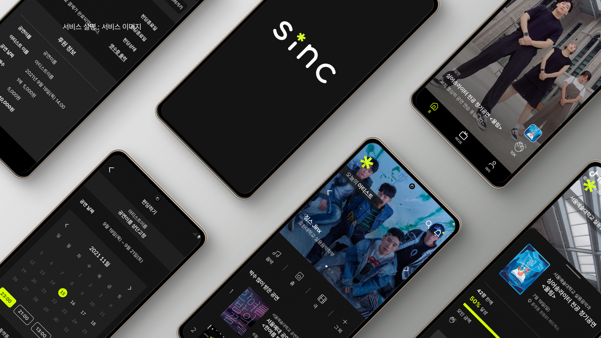

# 아티스트 공연 홍보/펀딩 서비스  **🔗 sinc** 
    
<p align="center"></p>

<br />

#### 📱 왜 하이브리드 앱인가?
- 앱을 다시 빌드하고 심사를 받아 업데이트 하는 과정이 줄어듦
- 유저도 업데이트 된 앱을 다시 다운받지 않아도 되기에 간편함
- 플랫폼과 상관 없이 웹 개발 기술을 가지고 앱을 개발할 수 있음
- 브라우저 API와 네이티브 API 모두 사용 가능함
- 한 번의 개발을 통해 여러 플랫폼에 대응 가능함
- 일반적으로  네이티브 앱 보다 빠른 기간 내에 개발 가능

#### 따라서 짧은 시간동안 진행되는 해커톤에서는 "하이브리드 앱"으로 개발하는 것이 적합하다고 결정!

<br />

### 📍 앱 구현
- React-Native의 react-native-webview 라이브러리를 사용하여 웹 앱 형식으로 구현
- 구름 IDE 안의 expo 라이브러리를 사용하여 앱 개발 확인 및 빌드
- 👉 [코드 저장소 바로가기](https://goor.me/xjbrc)   

<br/>

### 🖥 sinc의 뷰 소개

### 로그인 화면
사용자가 로그인을 하는 화면
- 카카오 api를 통한 사용자 로그인 화면(추후 구현 예정)

### 메인 화면
현재 인기있는 아티스트들과 공연, 숏폼 영상에 대한 정보를 한 눈에 볼 수 있는 화면
- swiper 라이브러리를 사용하여 상단 배너 구현
- 하단 네비게이션을 통해 페이지 라우팅

### 숏폼 영상 화면
숏폼 영상을 시청할 수 있는 화면
공감 버튼을 통해 아티스트/공연을 응원하거나, 공연 상세 페이지 버튼을 통해 공연에 대한 상세정보 얻기 가능하다.
- video tag를 이용한 숏폼 영상 제공

### 공연 상세정보 화면
공연의 상세 정보를 확인할 수 있는 화면
하단 버튼을 통해 펀딩 화면으로 넘어갈 수 있다.
- 메인화면에서 사용한 컴포넌트 재사용

### 펀딩 화면
공연을 후원하고, 예매할 수 있는 화면
- 커스텀 함수들을 통한 날짜, 시간 데이터 처리
- 토스 페이먼츠 api을 이용해 결제(추후 구현 예정)

### 마이페이지 화면(추후 구현 예정)
개인정보를 확인할 수 있는 화면
개인정보, 응원 내역, 펀딩 내역 등의 정보를 확인할 수 있다.
예매한 공연의 시간이 1시간 이내로 예정되어 있을 경우, 하단 모달을 통해 유저에게 알림을 전달하고, 티켓을 확인할 수 있다.

<br/>

### 📑 사용 라이브러리
```json
"dependencies": {
    "@svgr/webpack": "^5.5.0",
    "axios": "^0.24.0",
    "friendly-numbers": "^1.0.1",
    "graphql": "^16.0.1",
    "graphql-request": "^3.6.1",
    "next": "12.0.2",
    "react": "17.0.2",
    "react-dom": "17.0.2",
    "react-transition-group": "^4.4.2",
    "recoil": "^0.5.2",
    "styled-components": "^5.3.3",
    "styled-normalize": "^8.0.7",
    "swiper": "^7.3.1",
    "swr": "^1.0.1",
    "url-loader": "^4.1.1"
  },
  "devDependencies": {
    "@babel/core": "^7.16.0",
    "@storybook/addon-actions": "^6.3.12",
    "@storybook/addon-essentials": "^6.3.12",
    "@storybook/addon-links": "^6.3.12",
    "@storybook/builder-webpack5": "^6.3.12",
    "@storybook/manager-webpack5": "^6.3.12",
    "@storybook/react": "^6.3.12",
    "@types/next": "^9.0.0",
    "@types/node": "^16.11.6",
    "@types/react": "^17.0.33",
    "@types/react-dom": "^17.0.10",
    "@types/react-transition-group": "^4.4.4",
    "@types/recoil": "^0.0.9",
    "@types/styled-components": "^5.1.15",
    "@typescript-eslint/eslint-plugin": "^5.2.0",
    "@typescript-eslint/parser": "^5.2.0",
    "babel-loader": "^8.2.3",
    "eslint": "<8.0.0",
    "eslint-config-airbnb": "^18.2.1",
    "eslint-config-next": "^12.0.2",
    "eslint-config-prettier": "^8.3.0",
    "eslint-plugin-babel": "^5.3.1",
    "eslint-plugin-import": "^2.25.2",
    "eslint-plugin-jsx-a11y": "^6.4.1",
    "eslint-plugin-prettier": "^4.0.0",
    "eslint-plugin-react": "^7.26.1",
    "eslint-plugin-react-hooks": "^4.2.0",
    "prettier": "^2.4.1",
    "react-docgen-typescript-loader": "^3.7.2",
    "storybook-addon-styled-component-theme": "^2.0.0",
    "typescript": "^4.4.4"
  }
```
* **개발 관련 주요 라이브러리**
    - storybook
        
        컴포넌트의 종속성을 생각하지 않고 개별적으로 테스트 할 수 있다는 장점. 단기간에 프로젝트를 제작하는데 있어 시간이 오래 걸리는 단점이 있을 수도 있지만, 컴포넌트가 지속적으로 재사용되는 atomic design 구조상 단점을 감수할 만한 가치가 있다고 생각하여 도입. 
        
    - eslint, prettier
        
        개발 시 브랜치 간 충돌을 방지하기 위해서 사용. 
        
- **api 관련 주요 라이브러리**
    - graphql-request
        
        graphql을 통한 api 통신을 위해 사용.
        
- **상태관리 관련 주요 라이브러리**
    - recoil
        
        가볍고 쉽게 전역적인 상태 관리를 할 수 있다는 장점. 비동기 데이터와 관련되지 않은 상태들(Client State)을 전역적으로 관리하기 위해 사용.
        
    - swr
        
        비동기 데이터(Server State)를 관리하기 위하여 사용. 비동기 요청이 컴포넌트 각각에 의존할 수 있다는 단점이 존재하지만, atomic design 설계를 통해 page 단에서만 비동기 데이터를 관리하는 형식으로 단점을 보완.
        
- **css 관련 주요 라이브러리**
    - styled-components
        
        컴포넌트 형태로 css를 작성하여 props를 활용할 수 있다는 장점. 해당 라이브러리의 theme, global style를 style 셋업에 사용.
       
<br/>

### 📂 프로젝트 구조
```json
📦frontend
┣ 📂public
┣ 📂src
┃ ┣ 📂components
┃ ┃ ┣ 📂atoms
┃ ┃ ┣ 📂molecules
┃ ┃ ┣ 📂organisms
┃ ┃ ┗ 📂templates
┃ ┣ 📂pages
┃ ┣ 📂libs
┃ ┣ 📂assets
┃ ┣ 📂styles
┃ ┣ 📂hooks
┃ ┣ 📂interfaces
┃ ┣ 📂modules
┃ ┣ 📂apis
┃ ┗ 📜index.d.ts
┣ 📂.storybook
┣ 📜package.json
┣ 📜next-env.d.ts
┣ 📜next.config.js
┣ 📜tsconfig.json
┣ 📜.prettierrc
┣ 📜.babelrc
```
- atomic design 설계 방식에 따라 컴포넌트를 4개(atom, molecule, organism, template)의 계층적인 구조로 나누어서 제작.
- 순수한 컴포넌트를 만들기 위해, 컴포넌트에서는 비동기 데이터 또는 전역 상태 데이터를 다루지 않고, props로만 받아서 사용. 
- 비동기 데이터와 관련된 부분은 모두 page에 위치하도록 개발. 
- 비동기 데이터와 관련한 interface들은 따로 분리하여 interface 폴더에서 관리.

<br />

### ⛏ **개발 환경**
- OS: windows 10
- NPM version: 8.1.0
- NodeJS version: 16.13.0

